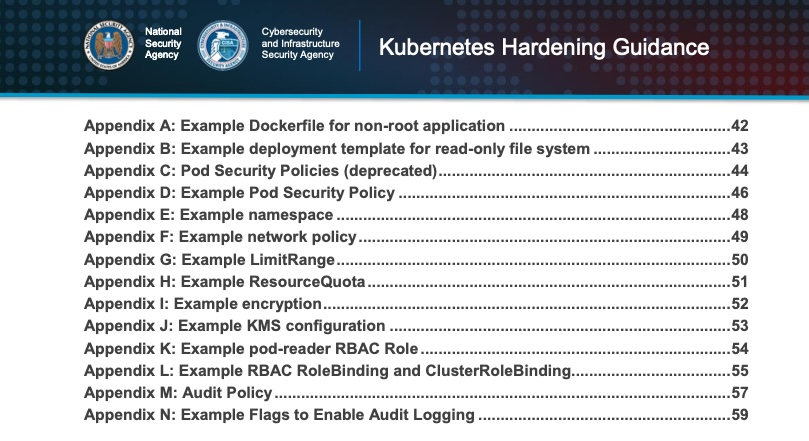

# How the NSA Kubernetes Hardening guide applies to Rancher and RKE2

Being a System Administrator over the last 20 years has been fun. For the longest time there was no real technical validation for systems. Especially when it comes to security. [STIGs](https://ncp.nist.gov/repository) and the [CIS benchmarks](https://www.cisecurity.org/cis-benchmarks/) have greatly helped in recent years. But it doesn't help with regards to the big picture concepts. Thanks to [NSA](https://www.nsa.gov/) and [CISA](https://www.cisa.gov) for developing the Kubernetes hardening [guide](https://www.cisa.gov/uscert/ncas/current-activity/2022/03/15/updated-kubernetes-hardening-guide). The hardening guide is a great tool for creating a secure strategy for any Kubernetes deployment. From the guide itself:

> This guide describes the security challenges associated with setting up and securing a Kubernetes cluster. It includes strategies for system administrators and developers of National Security Systems, helping them avoid common misconfigurations and implement recommended hardening measures and mitigations when deploying Kubernetes.

This article will help identify the recommendations pertinent to [Rancher](https://rancher.com/) and [RKE2](https://docs.rke2.io/) (Ranchers Government focused Kubernetes.)

---

> **Table of Contents**:
>
> * [What is the NSA Kubernetes Hardening Guide](#What-is-the-NSA-Kubernetes-Hardening-Guide)
>   * [Why is it important](#Why-is-it-important)
>   * [What’s in it](#What’s-in-it)
> * [How are all Kubernetes not equal](#How-are-all-Kubernetes-not-equal)
> * [Rancher - Secure by default](#Rancher---Secure-by-default)
> * [Key points from the Guide](#Key-points-from-the-Guide)
>   * [Kubernetes Pod Policy](#Kubernetes-Pod-Policy)
>   * [Network Separation and Hardening](#Network-Separation-and-Hardening)
>   * [Authentication and Authorization](#Authentication-and-Authorization)
>   * [Audit Logging and Threat Detection](#Audit-Logging-and-Threat-Detection)
>   * [Upgrading and Application Security Practices](#Upgrading-and-Application-Security-Practices)
> * [What did we learn](#What-did-we-learn)

---

## What is the NSA Kubernetes Hardening Guide

In March of 2022 the [NSA](https://www.nsa.gov/) released an updated version of the hardening the [Kubernetes Hardening guide](https://www.cisa.gov/uscert/ncas/current-activity/2022/03/15/updated-kubernetes-hardening-guide). We should probably level set a little on what Kubernetes is. From the guide itself.

> Kubernetes® is an open-source system that automates the deployment, scaling, and management of applications run in containers, and is often hosted in a cloud environment.

The guide is designed as minimum standard for hardening Kubernetes against some common attack vectors. Namely supply chain, malicious threat actors and insider threats. The guide covers the best practices for prevent and mitigate such attacks.

### Why is it important

Throughout my career there has always been a disconnect between the documentation and the practical, secure, implementation of software. The Kubernetes ecosystem is no stranger to this problem. Since Kubernetes is open-source there are about a dozen different distributions. Each distribution makes strategic decisions on the deployment details. Some vendors make good choices. Some vendors make bad choices. [Kubernetes Hardening guide](https://www.cisa.gov/uscert/ncas/current-activity/2022/03/15/updated-kubernetes-hardening-guide) is intended to bridge the gap from the initial install to a hardened, secure Kubernetes cluster. It is important to have a guide like this when the adversary never quits. This guide will also keep the dozen or so vendors honest with it comes to securing their Kubernetes distribution. If only Tesla had this guide before their Kubernetes cluster got ["hacked"](https://arstechnica.com/information-technology/2018/02/tesla-cloud-resources-are-hacked-to-run-cryptocurrency-mining-malware/). From the article:
>The initial point of entry for the Tesla cloud breach, Tuesday's report said, was an unsecured administrative console for Kubernetes, an open source package used by companies to deploy and manage large numbers of cloud-based applications and resources.

Meaning, had the guide been available the system administrators, hopefully, would not have exposed an un-authenticated dashboard. This dashboard gave the attackers full control of the cluster. The attackers were then able to escalate privileges to gain access to customer databases themselves.

### What’s in it

The guide covers the topics from a couple of major categories.

* Kubernetes Pod Policy
* Network Separation and Hardening
* Authentication and Authorization
* Audit Logging and Threat Detection
* Upgrading and Application Security Practices

The guide does a great job showing technical examples for a lot of the topics. Again providing a strong, secure technical foundation. In this article we are not going to go too deep. Please check out the [Key Points](#Key-points-from-the-Guide) section for more technical information.

## How are all Kubernetes not equal

[Kubernetes](https://kubernetes.io/) is open source and free to use by anyone. This is good and bad. Take a look at the [vendor list](https://kubernetes.io/partners/#conformance). However Kubernetes has a slight complexity problem. When vendors take the underlying code and package it they make tradeoffs. Some vendors lean towards having a complete experience at the cost of security. Some lean towards lock-in of an entire ecosystem. One vendor builds additional object types on top of Kubernetes. Meaning it is very difficult to change distributions if you rely on that object. Rancher, and RKE2, leans toward security. So really, what makes Rancher and RKE2 different?

## Rancher - Secure by default

What makes Rancher and RKE2 different is the approach towards security. RKE2 is a fully conformant Kubernetes distribution that focuses on security and compliance within the U.S. Federal Government sector. To meet these goals, RKE2 does the following:

* Provides [defaults and configuration options](https://docs.rke2.io/security/hardening_guide/) that allow clusters to pass the [CIS Kubernetes Benchmark v1.6](https://docs.rke2.io/security/cis_self_assessment16/)
* Enables [FIPS 140-2 compliance](https://docs.rke2.io/security/fips_support/)
* Regularly scans components for CVEs using [trivy](https://github.com/aquasecurity/trivy) in our build pipeline

Rancher, as a product, builds on top of RKE2 foundation adding manageability for downstream clusters. The Rancher Management layer also provides a central authentication and authorization management. Rancher also provide a single pain of glass for GitOPs and virtual machines.

For more information about the STIGS please check out Rancher Government's [Security page](https://ranchergovernment.com/security). We list the current and upcoming STIGs/CIS Benchmarks for the Rancher/RKE2.

Let's see how the guide applies to RKE2 and Rancher.

## Key points from the Guide

Following the guide itself...

### Kubernetes Pod Policy

This section talks more about building secure images, rootless containers, and the underlying container engine. While RKE2 ships with [ContainerD](https://containerd.io/) it is replaceable with the engine of choice.

### Network Separation and Hardening

1. >Use network policies and firewalls to separate and isolate resources.

    RKE2 uses Canal as the default. However there are several to choose from "none, calico, canal, cilium; optionally with multus". Picking the best CNI that fits your environment is important.

    >“Canal” is a shorthand for saying “Calico and Flannel”, a common practice which sets up Calico to handle policy management and Flannel to manage the network itself. This combination brings in Calico’s support for the NetworkPolicy feature of Kubernetes, while utilizing Flannel’s UDP-based network traffic to provide for an easier setup experience that works in a wider variety of host network environments without special configuration. - https://ubuntu.com/kubernetes/docs/cni-canal

2. >Secure the control plane.

    Ideally the entire cluster would be behind a firewall that can used for isolation. Adding Rancher, as an additional management layer, will allow for a single point of entry for management tasks. Rancher then can apply all the authentication and authorization to the underlying RKE2. This approach will provide a decreased surface area for the cluster and getter control.

3. >Encrypt traffic and sensitive data (such as Secrets) at rest.

    RKE2 supports [Secret Encryption](https://docs.rke2.io/security/secrets_encryption/) out of the box.

On thing to add to network isolation is that Rancher provides the ability to single click install [Istio](https://istio.io/). Istio provides additional network isolation capabilities as a service mesh.

### Authentication and Authorization

The key points for Authentication and Authorization revolve around actually implementing it. One of the key features that Rancher adds to RKE2 is centralized user authentication. Several popular authentication methods include OIDC and SAML2. Rancher supports a [large number](https://rancher.com/docs/rancher/v2.6/en/admin-settings/authentication/) of methods. In addition Rancher can manage RBAC for not just one cluster, but many.

### Audit Logging and Threat Detection

All the key points from the guide point to enabling audit logs and using third party security tools. Keep in mind audit logging is very important to understand who is interacting with the cluster. There are several ways implement this. First, enable the audit log in RKE2 during the [initial install](https://docs.rke2.io/install/install_options/server_config/). Second enabling Rancher's api audit during it's [install](https://rancher.com/docs/rancher/v2.6/en/installation/install-rancher-on-k8s/chart-options/#api-audit-log). As for higher levels of threat detection we can recommend another open source tool from Rancher/Suse - [Neuvector](https://neuvector.com/).

Neuvector stands above other products on the market with it's ability to actively defend against unknown or unexpected behavior. Most products in this category require pre-written policies. Neuvector has the ability to baseline and block anything outside the normal behavior.

### Upgrading and Application Security Practices

The key point about section is to ensure that all the components are upgraded in a timely manor. Similar to how [Equifax](https://arstechnica.com/information-technology/2017/09/massive-equifax-breach-caused-by-failure-to-patch-two-month-old-bug/) didn't patch Apache Struts. All of our infrastructure needs to be updated. RKE2 helps with this by providing simple [installation methods](https://docs.rke2.io/install/methods/). In turn, this makes keeping the cluster updated very easy and automatable. Rancher has similar deployment strategies. Rancher also includes a Continuous Delivery (CD) tool built in called [Fleet](https://fleet.rancher.io/). At a high level, Fleet allows a team apply GitOPs methods to managing application's lifecycle. Simply put, use Git to push updates to the applications being deployed. Also known as Infrastructure as Code.

## What did we learn

There is a lot of valuable information within the guide itself. The are other great resources for specific implementation of similar recommends. Specifically looking at the STIGs and the CIS benchmarks. Rancher Government's [Security](https://ranchergovernment.com/security) page had more information about those guides/benchmarks.

Another major take away is that these guides are also being updated. Please make sure to keep current on the latest code AND guides.

Hope this helped in demystifying the hardening guide. As well as applying it to Rancher and RKE2.
